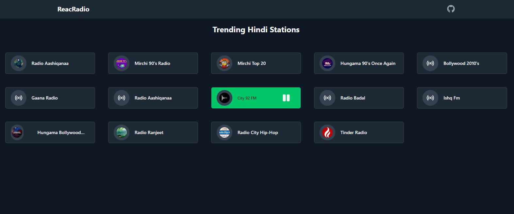

 <h1> ❄️ ReacRadio ❄️ </h1>

## Description 🦚
**ReacRadio**, is a simple, single page, free Radio Streaming Web App based on [Radio-Browser](https://www.radio-browser.info/). Currently only Indian Hindi station are added but other country or language specific stations can be added too.
Its aim is to provides a simple and smooth user experience with features including:

 - **PWA**  
 - **Stream Radio** 
 - **Dark Mode** 

## Screenshots 🖼
   - **Home Page**   
      

## Acknowledgements 🙏
- [Radio-Browser](https://www.radio-browser.info/)
- [Vercel](https://vercel.com/)
